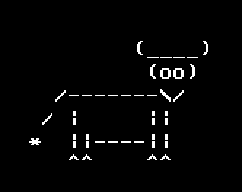
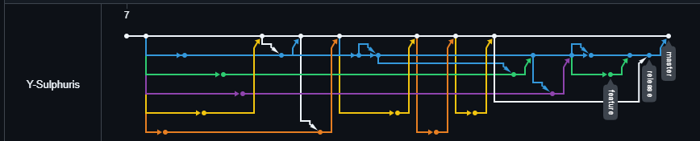

# Bulls and Cows

A simple logic game where you need to guess a generated number based on previous attempts

The output will indicate how far are you from the number 
bull means that your guess contains a correct digit in the right place, cow means that your guess contains a correct digit in the wrong place

For example, if guessed number is `6138`, the output for guess `1234` shall be `1 bull, 1 cow`, as guess contains 1 in the wrong place and 3 in the right one

## Additional information

Installation guide: [install.md](install.md) 
Changelog: [changelog.md](changelog.md)

## Network graph:
**There are some ugly pulls to the master branch because I mixed the target branches up, but all of them have been reverted**

